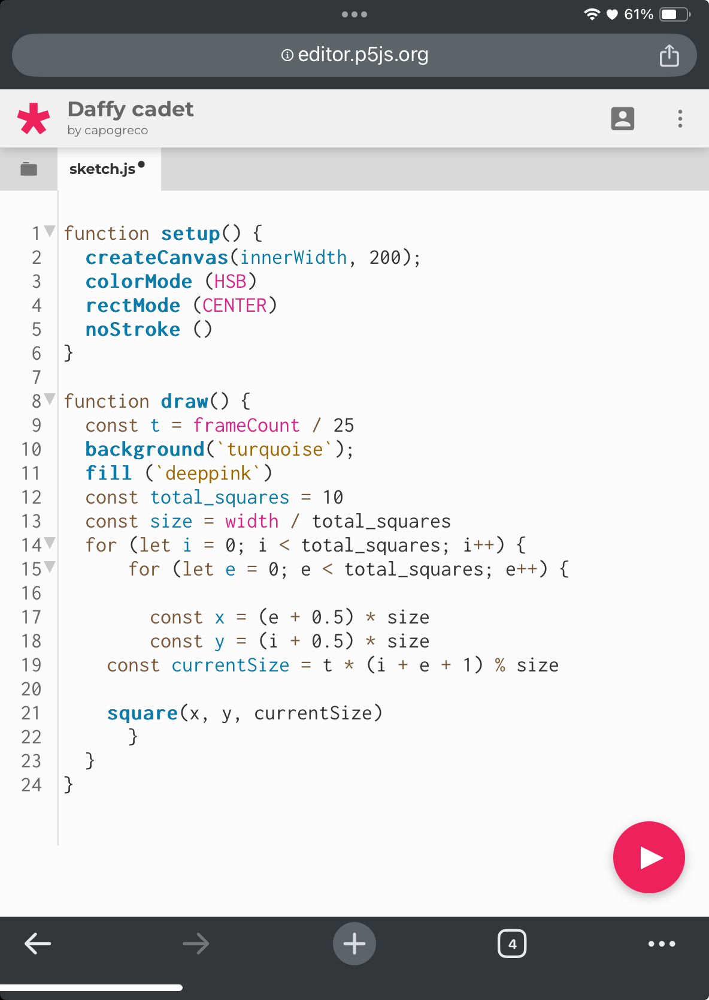
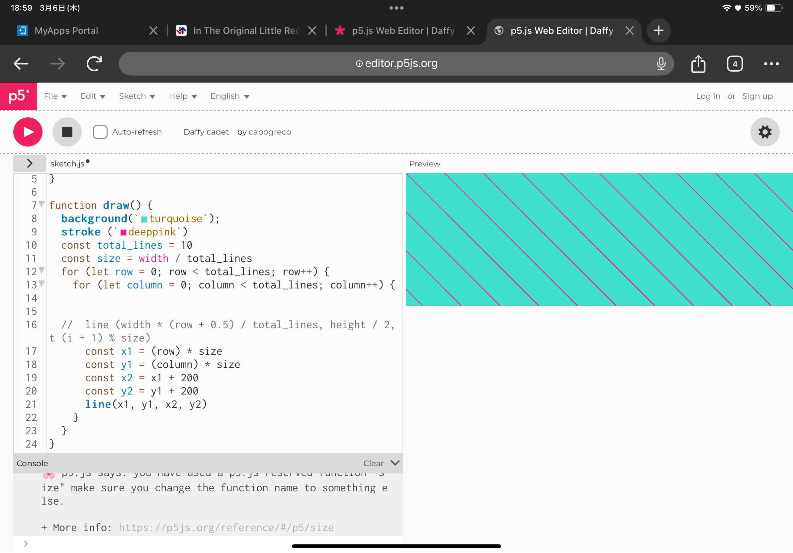
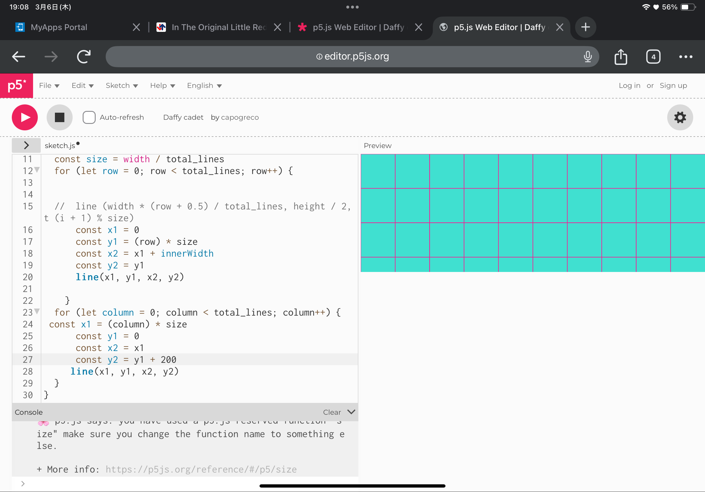

# Hello!

I'm Minami, a 2nd year student at RMIT. 
 
Homework: Grids!

I made a grid using "for loops". Initially I misunderstood the instructions, and increase the number of squares vertically, imitating a grid look. I did this with the help of ChatGPT. 

Unfortunately, I soon realized that this was not what was asked in the instruction, and went on to learn about lines and loops.
  
My first attempt in using for loops for lines turned out like this: 
 

I derived the code from the previous attempt with the squares, which only required a single "square()" function to let squares appear in lines vertically and horizontally (on the x and y axis). However, this method did not work as the lines were drawn diagonally in one direction, instead of intersecting into a grid.  
I did some more research in the p5 library, and referenced the code from the squares, to fit the logic of lines. The translation process required me to define two "line()" function with for loops, one for the horizontal rows, and one for the vertical columns.  
Moreover, the lines required a different set of limits from squares, so I had multiple tries on getting the lines to start and end at the desired point. I ended up with the following sets of limits:  

My final attempt turned out to be like this:

Homework 2: Rafaël Rozendaal

I chose the work "Push", as the strokes and movement reminded me of Slither.io!

So, how does the code work??
I first broke down "Push" into layers which were visible. 
Layers = background, lines, dots

Draw curvy lines by increasing pivots setting xy positions.

Only the dots are moving, so the dot should be following a path following the lines. Moving using a for loop. 

What i dont know = how do the lines and dots overlap?? I know that setting in order allows the object to show on top of each other.  
How do the strokes/colors randomly change through a click?

Concepts to learn:

Shapes: beginShape(), vertex(), endShape() 
Bezier Curve: bezier() 
Layering: draw() 
Animation: array, lerp() 