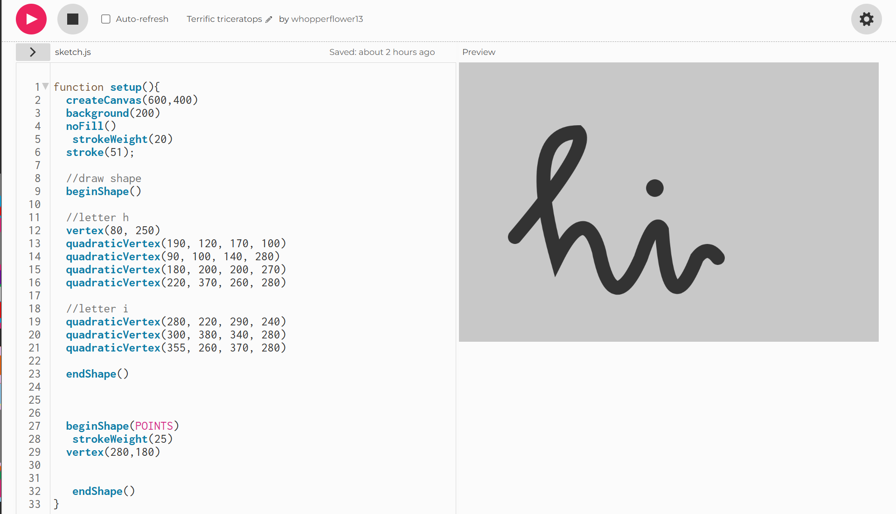
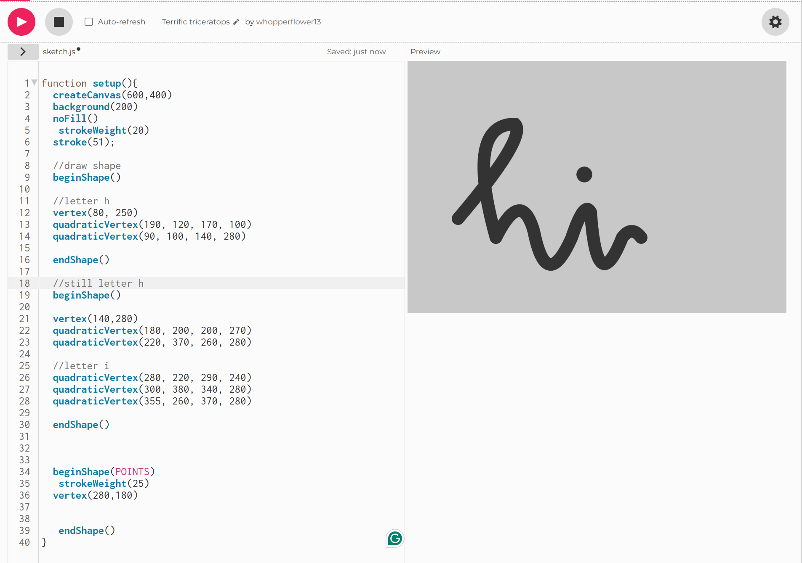

# Hello!

<!-- speak to three of your classmates about the Rafaël RozendaalLinks to an external site.work you chose last session, and document your discussions on your blog. Ask each of them:
what do you think is going on, under the hood?
what concepts would I need to understand in order to replicate this work in p5?
what resources might help me to learn those concepts?-->

I discussed about the work by Rafaël Rozendaal with my classmates. They analyzed that the main part of the work (the snake-like strokes) to be constructed with a set of points or verticies that draw a curvy line, which also is the path for the dots to move on top. 
A new insight I gained while discussing the work was that the three set of strokes were not rewritten on each click, they were a fixed set of strokes. There are 24 different color combinations, that loop through on a mouse click.

The concepts that were needed to be understood were vertex, loop, randomization, order

<!-- take one the concepts from the previous question, and implement it in the p5 online editorLinks to an external site..  Embed your sketch in your blog, detailing how the code is working, and the resources and or communities you engaged with in order to learn about it.  -->

The concept I chose was vertex.
I learned about "vertex()" and "quardraticVertex()".

I set the parameters for the stroke's start, end, and control points.

I wanted the downward stroke in the h to be rounder, so i created a separate shape for the strokes after that vertex.

This is finished sketch!
<iframe src="https://editor.p5js.org/whopperflower13/full/9zD-vdCjq"></iframe>
Although this is not as fancy or convoluted as Rozendaal's work, this making this sketch taught me a core concept to create shapes outside of the primitive shape choices.Additionally, the process of defining the parameters made me more familar with the x and y units.