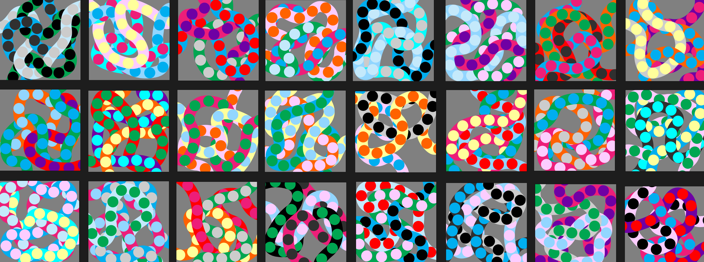

# Hello!

<!-- speak to three of your classmates about the Rafaël RozendaalLinks to an external site.work you chose last session, and document your discussions on your blog. Ask each of them:
what do you think is going on, under the hood?
what concepts would I need to understand in order to replicate this work in p5?
what resources might help me to learn those concepts?-->

I discussed about the work by Rafaël Rozendaal with my classmates. They analyzed that the main part of the work ()
Set of points or verticies draw a curvy line, which also is the path for the dots to move on top. 
Another point which we found out while discussing the work was that the three set of strokes are not rewritten on each click, they were just positioned at a random angle
loop
randomization
order

friend feedback

<!-- take one the concepts from the previous question, and implement it in the p5 online editorLinks to an external site..  Embed your sketch in your blog, detailing how the code is working, and the resources and or communities you engaged with in order to learn about it.  -->